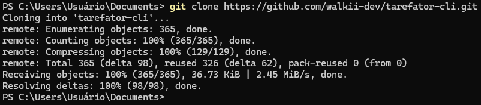

# Tarefator-cli

O 'Tarefator-cli' é uma aplicação de linha de comando a qual permite ao usuário 
gerenciar tarefas. O intuito é simular e simplificar a organização das tarefas
do dia-a-dia.
O projeto é feito em java puro, sem o uso de bibliotecas externas, unindo 
conceitos do java clássico e rústico (como loops simples e condições) ao java 
moderno, como classes wrappers(Integers) e bibliotecas nativas (Scanner, Files,
StringBuilder).

## Tecnologias usadas:
___
- Java 21 (Eclipse Temurin 21.11);
- Orientação a Objetos (Abstração, Encapsulamento);
- Bibliotecas Nativas como Integer, Scanner, Files, StringBuilder, entre outros;
- Utilização de Streams e Lambdas;
- Uso da estrutura de dados List;

## Executando a aplicação
___

Nesta página mesmo , clique no botão de "code" em verde, depois na opção "HTTPS" e, ao
lado do texto, clique no ícone que está a direita. Ele copiará o código da aplicação.

Na sua IDE preferida (ou de preferência o Intellij IDEA), abra um terminal na pasta 
desejada e digite "git clone ". Após isso, cole o código que foi copiado e aperte 'Enter.'

*Resultado esperado após a clonagem do repositório.*

Após o projeto ter sido completamente colado, navegue até a pasta principal do projeto,
simplesmente executando o comando `cd tarefator-cli/src/main/java/org/educational`.

Na pasta principal, faça a compilação do código pelo comando `javac Main.java`
e inicie a aplicação com `java Main.java`.

## Como utilizar
___

- Para adição de tarefas, digite `add <descrição>`. exemplo : `add "acordar"`
*"Saída: 'task "acordar" created with success! (ID: 1 )"*
- Para deleção de tarefas, digite `delete <ID>`. exemplo: `delete 1`
*"Saída: 'task "acordar" deleted."*
- Para marcar uma tarefa como `in-progress` ou `done`, basta apenas inserir o id após
`mark-in-progress` ou `mark-done`.
- Para listar todas as tarefas criadas, digite somente `list`. Se preferir
listar por tipo, você pode inserir `list done` , `list in-progress` ou `list todo`.

Para qualquer dúvida, o comando `help` na aplicação pode te ajudar ou relembrar.

## Desafios do projeto
___
A utilização de *somente* bibliotecas nativas da linguagem possibilitou que houvesse muito
manejamento de String, então de qualquer forma foi bom entender a concatenação de Strings
e a recuperação de valores delas para o projeto.

Algo que foi trabalhoso foi lidar com arquivos externos da aplicação, partindo do ponto que
o desafio original pediu que guardássemos as tarefas em um arquivo json, mantendo sua 
formatação.

O uso da estrutura de dados **List** foi essencial para fazer com que a aplicação ficasse 
mais organizada, e lidando direta e dinamicamente com as solicitações do usuário.

## Próximos passos
___
- [x] leitura de comandos do usuário
- [x] criação de tarefas
- [x] criação /recuperação de dados via arquivo .json
- [x] tratamento de erros de serialização/ desserialização
- [x] Deleção de tarefas
- [x] Edição de tarefas
- [x] Listagem de tarefas por tipo
- [ ] Implementação Docker

***Licença do Projeto: MIT License*** 

